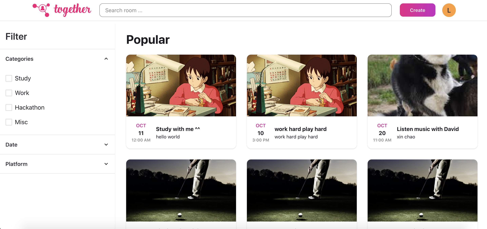

  

 

## Together 👨‍👧‍👧
I hope you are well, staying safe and healthy. I have started working remotely during the pandemic. My routine in this time is getting up, eating, working, then eating and go to sleep, day by day, a cycle :(. To be honest, I feel a bit lonely. Then I join a group on Facebook. The admin of this group creates an event where group members can join a Zoom room and study, working together. I also join this event, it's great fun. I meet a lot of people. It makes me don't feel alone anymore. So I wonder why don't I create a website where people can put their room link (use Google Meet, Zoom, or Gather ...) then other people can join. So I created Together. 👨‍👧‍👧

## 🗂 Tech Stack

Below is a list of technologies we use at Together.

## Team

- **Vincenzo**
  - [Twitter](https://twitter.com/trankhac_vy)
  - [Github](https://github.com/trankhacvy)
- **Selina**
  - [Facebook](https://www.facebook.com/thanhhuong.dokhoo)
- **Khac Bao**
  - [Facebook](https://www.facebook.com/baodesigner96) 
  

## ✨Features

- [x] **Create room**
- [x] **View, search rooms**
- [x] **Join room**
- [x] **Add to calendar**
- [ ] **Allow user create categories**
- [ ] **Create `like`, `interested`, `joining` buttons**
- [ ] **Allow user can report room**
- [ ] **Share room on facebook, twitter ...**
- [ ] and more...

## How did I actually use Supabase in Relm
- [x] **Supabase Auth** for authentication
- [x] **Supabase Database** for storing users, rooms, categories ...
- [x] **Supabase Storage** for storing user's avatar, room's banner
- [ ] **Supabase Realtime** for "live room" feature.

## License

[ISC](LICENSE) © 2021 Vincenzo